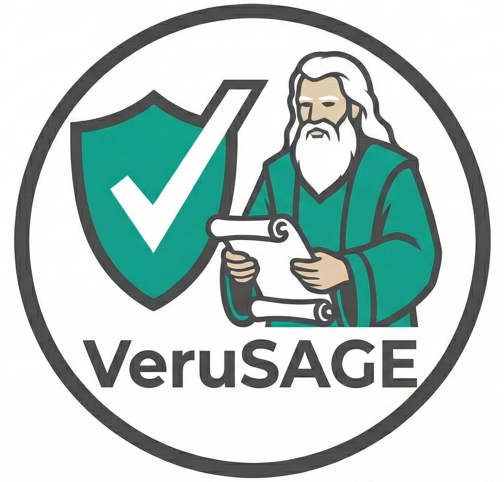
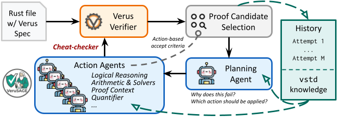

# Verus Proof Synthesis

<p align="left">
    <a href="https://arxiv.org/abs/2409.13082"></a>
    <a href="https://arxiv.org/abs/2512.18436"></a>
    <a href="https://sites.google.com/view/autoverus"></a>
</p>

This repository contains code and artifacts for automated [Verus](https://github.com/verus-lang/verus) proof synthesis using LLM-based approaches. It includes two proof synthesis systems and two benchmark suites.

---

## � Repository Contents

| System | Description | Benchmark |
|--------|-------------|-----------|
| **[AutoVerus](#-autoverus)** | Three-phase proof synthesis for algorithms | **[Verus-Bench](#verus-bench)** (150 tasks) |
| **[VeruSAGE](#-verusage)** | Agent-based verification for systems code | **[VeruSAGE-Bench](#verusage-bench)** (849 tasks) |

---

##  AutoVerus

**AutoVerus** uses a three-phase approach to generate formal proofs for Rust programs:
1. **Inference** - Generate initial proof candidates using few-shot examples
2. **Refinement** - Refine promising candidates with targeted improvements
3. **Repair** - Debug and fix remaining verification errors


### Quick Start

```bash
cd autoverus
python main.py --input <input_file.rs> --output <output_file.rs> --config config.json
```

👉 **[AutoVerus Documentation](autoverus/README.md)**

---

##  VeruSAGE

**VeruSAGE** is an LLM-powered agentic framework that excels at complex systems verification with an observation-reasoning-action loop.



### Quick Start

```bash
cd verusage
python main.py --config config.json --input your_file.rs --output repaired_file.rs
```

👉 **[VeruSAGE Documentation](verusage/README.md)**

---

## 📊 Benchmarks

### Verus-Bench

**150 algorithm-level verification tasks** from classic CS problems.

| Source | Tasks | Description |
|--------|-------|-------------|
| CloverBench | 11 | Classic CS examples |
| MBPP | 78 | Formal specification problems |
| Diffy | 38 | Array/loop programs |
| Misc | 23 | Verus tutorial examples |

👉 **[Verus-Bench README](benchmarks/Verus-Bench/README.md)**

### VeruSAGE-Bench

**849 repository-level verification tasks** from real-world systems projects.

| Project | Tasks | Domain |
|---------|-------|--------|
| Anvil (AL) | 104 | Distributed Systems |
| Anvil-Advanced (AC) | 63 | Distributed Systems |
| IronKV (IR) | 118 | Key-Value Store |
| Memory Allocator (MA) | 89 | Systems |
| Node Replication (NO) | 29 | Distributed Systems |
| NRKernel (NR) | 204 | OS Kernel |
| ATMO (OS) | 157 | Microkernel |
| Storage (ST) | 63 | Storage Systems |
| Vest (VE) | 22 | Serialization |

👉 **[VeruSAGE-Bench README](benchmarks/VeruSAGE-Bench/README.md)**

---

## 🚀 Installation

### Docker (Recommended)

```bash
docker build -t verus-proof-synthesis .
docker run -it verus-proof-synthesis
```

### Local Setup

**Prerequisites:**
- Python 3.10+
- [Verus](https://github.com/verus-lang/verus) (see version requirements below)
- OpenAI or Azure OpenAI API key

```bash
# Clone repository
git clone https://github.com/microsoft/verus-proof-synthesis.git
cd verus-proof-synthesis

# Install dependencies
pip install -r requirements.txt

# Set API key
export OPENAI_API_KEY=<your-openai-api-key>
```

**Verus Installation:**
```bash
git clone https://github.com/verus-lang/verus.git
cd verus
git checkout 33269ac6a0ea33a08109eefe5016c1fdd0ce9fbd  # For Verus-Bench
# git checkout ddc66116aa7a844a9e19cc50922fe85c84b8b4a5  # For VeruSAGE-Bench
./tools/get-z3.sh && source tools/activate
vargo build --release
```

---

## 📁 Directory Structure

```
verus-proof-synthesis/
├── autoverus/          # AutoVerus implementation
│   ├── main.py         # Single-file proof generation
│   ├── verify.py       # Batch benchmarking tool
│   └── examples/       # Few-shot training examples
├── verusage/           # VeruSAGE implementation
│   ├── main.py         # Single-file repair
│   ├── run_batch.py    # Batch processing
│   └── agents/         # Agent framework
├── benchmarks/
│   ├── Verus-Bench/    # 150 algorithm tasks
│   └── VeruSAGE-Bench/ # 849 systems tasks
├── utils/lynette/      # Verus parser for proof synthesis
└── generated/          # Pre-generated proof results
```

---

## 📚 Further Reading

- **AutoVerus Paper**: [arXiv:2409.13082](https://arxiv.org/abs/2409.13082)
- **VeruSAGE Paper**: [arXiv:2512.18436](https://arxiv.org/abs/2512.18436)
- **Project Website**: [sites.google.com/view/autoverus](https://sites.google.com/view/autoverus)
- **Verus Documentation**: [verus-lang.github.io/verus/guide](https://verus-lang.github.io/verus/guide/)
- **Artifact Evaluation** for AutoVerus: [README-artifact-evaluation.md](README-artifact-evaluation.md)

---

## Contributing

This project welcomes contributions and suggestions. Most contributions require you to agree to a Contributor License Agreement (CLA) declaring that you have the right to, and actually do, grant us the rights to use your contribution. For details, visit https://cla.microsoft.com.

When you submit a pull request, a CLA-bot will automatically determine whether you need to provide a CLA and decorate the PR appropriately (e.g., label, comment). Simply follow the instructions provided by the bot. You will only need to do this once across all repositories using our CLA.

This project has adopted the [Microsoft Open Source Code of Conduct](https://opensource.microsoft.com/codeofconduct/). For more information see the [Code of Conduct FAQ](https://opensource.microsoft.com/codeofconduct/faq/) or contact [opencode@microsoft.com](mailto:opencode@microsoft.com) with any additional questions or comments.

## Trademarks

This project may contain trademarks or logos for projects, products, or services. Authorized use of Microsoft trademarks or logos is subject to and must follow Microsoft's Trademark & Brand Guidelines. Use of Microsoft trademarks or logos in modified versions of this project must not cause confusion or imply Microsoft sponsorship. Any use of third-party trademarks or logos are subject to those third-party's policies.

---

## Citation

If you find this work useful, please consider citing:

```bibtex
@article{autoverus,
  title={AutoVerus: Automated Proof Generation for Rust Code},
  author={Chenyuan Yang and Xuheng Li and Md Rakib Hossain Misu and Jianan Yao and Weidong Cui and Yeyun Gong and Chris Hawblitzel and Shuvendu K. Lahiri and Jacob R. Lorch and Shuai Lu and Fan Yang and Ziqiao Zhou and Shan Lu},
  journal={Proceedings of the ACM on Programming Languages},
  volume={9},
  number={OOPSLA2},
  year={2025},
  publisher={ACM New York, NY, USA}
}

@misc{verusage,
  title={VeruSAGE: A Study of Agent-Based Verification for Rust Systems},
  author={Chenyuan Yang and Natalie Neamtu and Chris Hawblitzel and Jacob R. Lorch and Shan Lu},
  year={2025},
  eprint={2512.18436},
  archivePrefix={arXiv},
  primaryClass={cs.OS},
  url={https://arxiv.org/abs/2512.18436},
}
```
